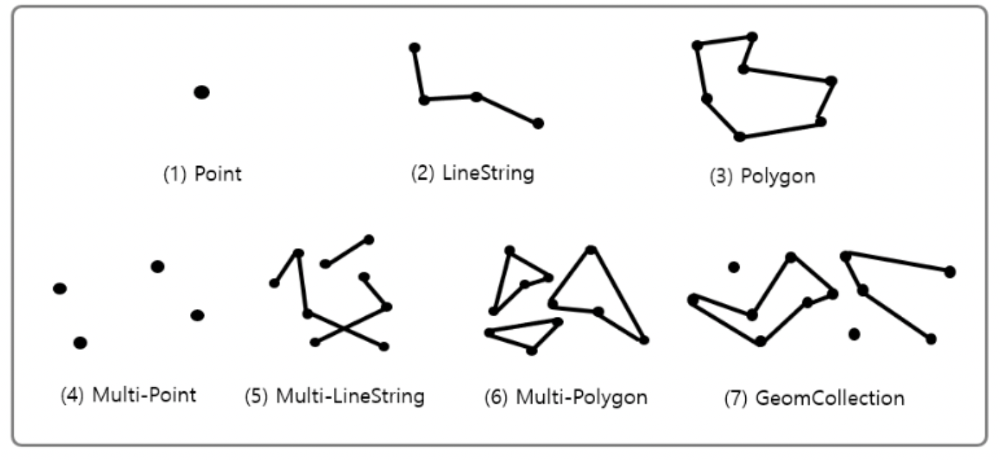
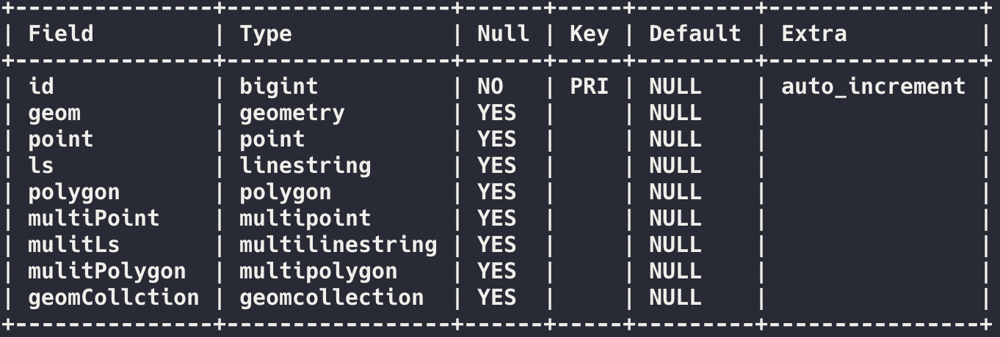
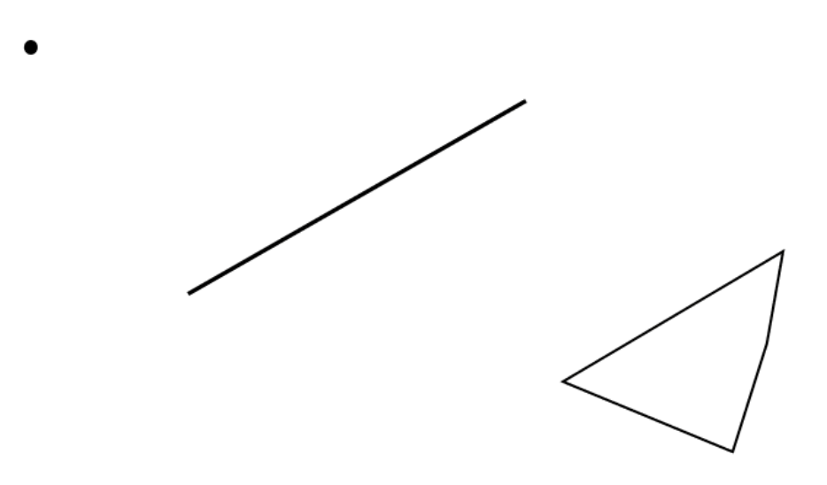
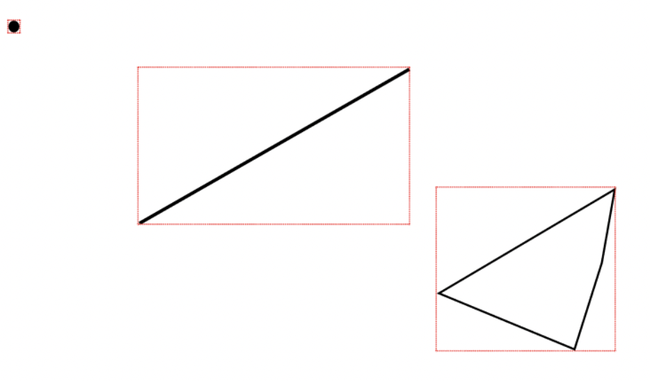
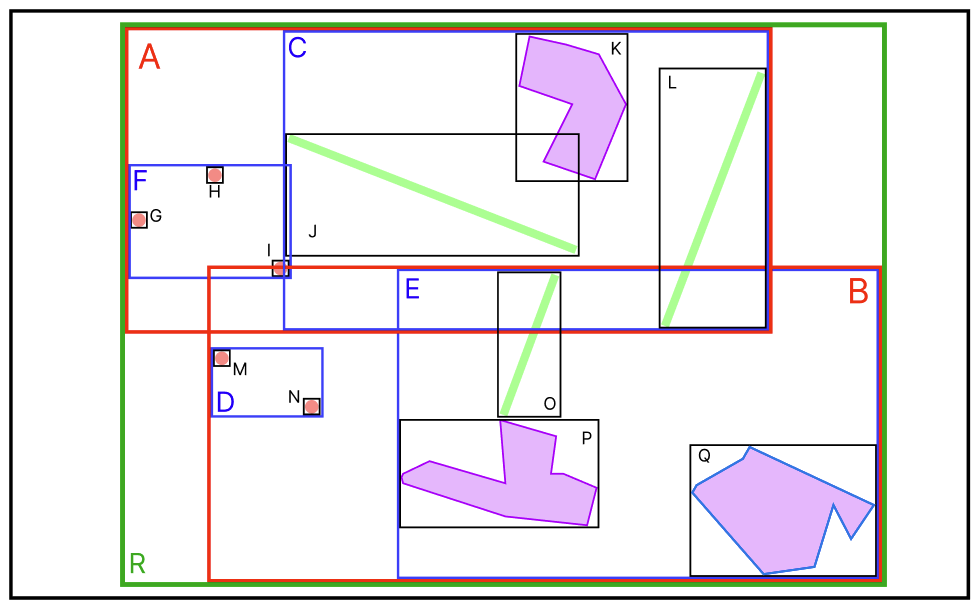
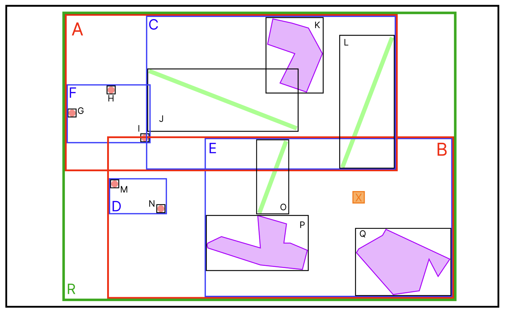
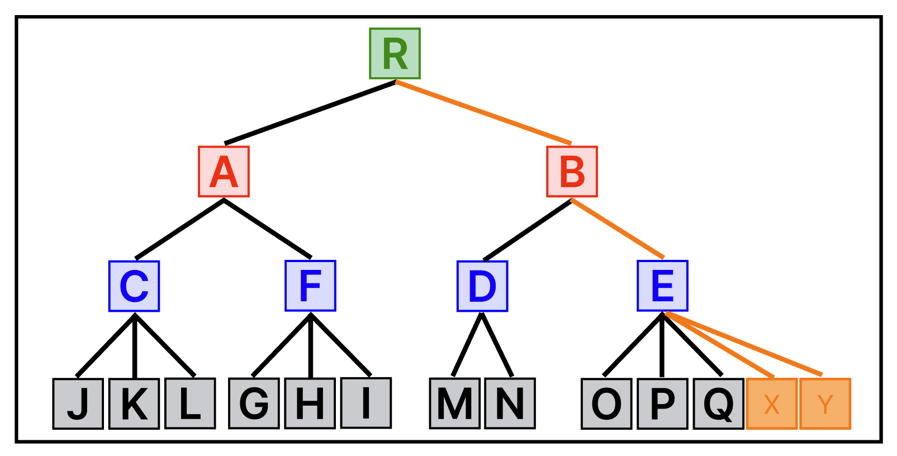
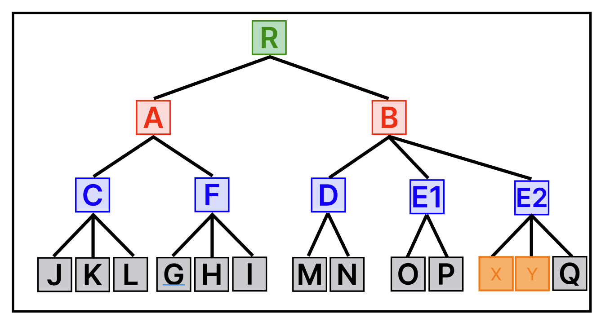
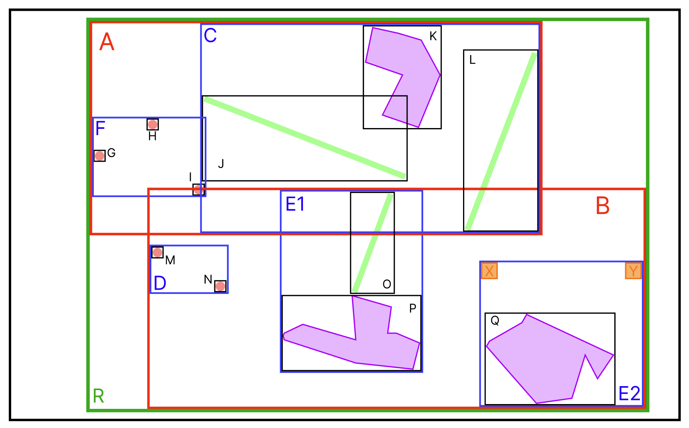
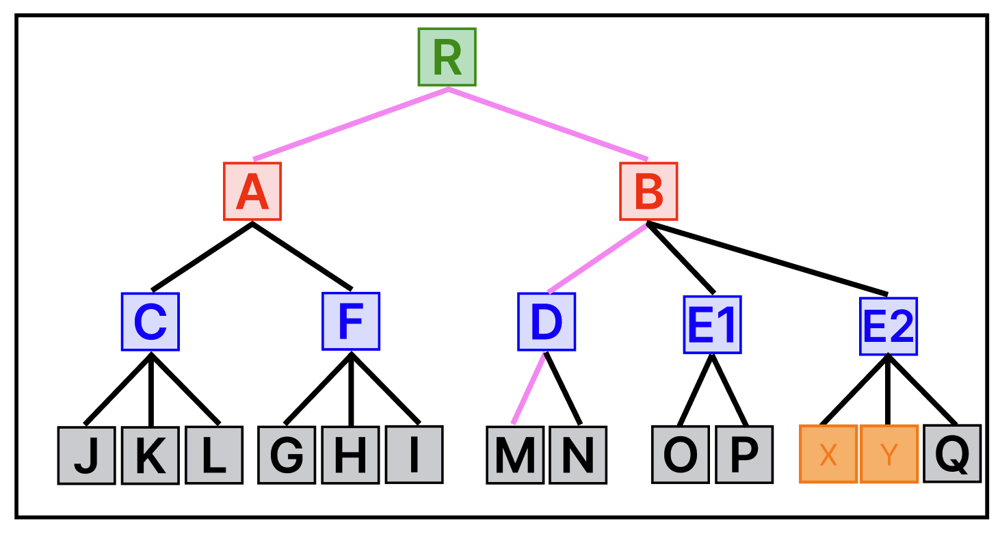

# 들어가며

성수동에 위치한 힙하고 트렌디한 카페를 쉽게 찾을 수 있는 [요즘카페](https://yozm.cafe)서비스에 지도 기능을 추가하기로 했다.


기능 개발을 위해 공부하던 중 공간데이터에 대해 알게 되어 이를 적용 해보기로 했다.  
그러나 처음 접해본 개념인 데다가, 레퍼런스도 여기저기 흩어져 있다 보니 여간 애를 먹은 게 아니었다.  
한 번에 정리된 글이 있으면 좋을 것 같아, 학습한 내용을 공유하고자 한다.

# 1. MySQL의 공간 데이터

## 1-1. 공간데이터 타입



MySQL에서 제공하는 공간데이터의 종류는 총 7가지이다.
단일 타입으로는 `Point`, `LineString`, `Polygon` 세 가지가 있고,
나머지 타입들은 이 세 가지 타입의 조합이다.

> - **Point** : 좌표 공간의 한 지점
> - **LineString** : 다수의 Point를 연결해 주는 선분
> - **Polygon** : 다수의 선분이 연결되어 닫혀있는 상태



각각의 컬럼에는 당연하게도 알맞은 데이터 타입만 입력할 수 있지만,
`geometry` 타입에는 **모든 공간 데이터 타입의 입력이 가능**하다.

## 1-2. 공간 함수

공간 데이터들은 **공간 함수**를 통해 활용할 수 있다.
공간 함수에 대해선 [공식 문서](https://dev.mysql.com/doc/refman/8.0/en/spatial-function-reference.html) 에 잘 소개되어 있으니, 여기서는 대표적으로 사용 되어지는 몇 가지의 함수만 확인하려 한다.

| 함수명 | 설명 |
| ---- | --- |
| ST_GeomFromText(WKT*[, SRID]*) | WKT와 SRID를 통해 geometry를 생성한다. |
| ST_Buffer(*(Multi)* Point, Radius) | Point(또는 MultiPoint)로 부터 Radius를 반지름으로 갖는 원을 그린다. |
| ST_Contains(geom(a), geom(b)) | b가 a에 포함되어 있으면 1을 반환, 아니면 0을 반환.  |
| ST_Within(geom(a), geom(b)) | a가 b에 포함되어 있으면 1을 반환, 아니면 0을 반환.(ST_contains와 인자가 반대) |
| ST_Distance(geom(a), geom(b)) | a와 b사이의 거리 |

**WKT**(**W**ell-**K**nown-**T**ext)는 공간 데이터를 텍스트 형식으로 표현하는 방법 중 하나이다.
WKT는 기하학적인 객체를 설명하기 위해 사용되며, 다양한 유형의 공간 개체를 나타낼 수 있다.  
*예) POINT(80 110) , LINESTRING(0 0, 10 10) , POLYGON(0 0, 10 10, 20 20, 0 0)*

> **ST_**
>
> `ST_` 라는 prefix가 붙어있는데, `Spatial`의 약어이다.
> 공간 함수라는 것을 명시적으로 보여주고, 다른 함수들과 네이밍이 겹치지 않게끔 하는 역할을 한다.
## 1-3. SRID

공간 데이터를 설명하며 빼놓을 수 없는 개념 중 하나인,
SRID(**S**patial **R**eference **Id**entifier)는 데이터의 지리적 좌표계에 대한 정보를 구분해 주는 유일한 식별 코드이다.  
가장 흔하게 사용되는 값은 `4326`으로 `WGS84` 좌표계를 의미한다.
`WGS84`는 위도(Latitude)와 경도(Longitude)를 사용하여 위치를 표현하며, GPS 및 다양한 GIS 솔루션에서 널리 사용된다고 한다.

`MySQL`에 입력되는 데이터에도 이 SRID 값을 지정해 줄 수가 있다.


위의 그림에서 첫 번째 데이터는 SRID 값을 지정해 주지 않아 기본값인 0으로 입력이 되었다.
문제는 `MySQL`에는 한번 입력된 데이터의 SRID 값을 수정할 수 있는 방법이 없다.  
즉, 해당 데이터를 지우고 다시 입력하거나, `UPDATE` 쿼리를 사용해야 한다.

한두 개의 데이터야 직접 수정하면 된다지만, 잘못 작성된 쿼리로 입력된 데이터가 100개, 1000개, 10000개가 된다면,
이를 수정하는 것은 제법 귀찮은 일이 될 것이 분명하다.  
귀찮은 일의 발생을 막기 위해 처음부터 값을 잘 입력하는 것이 매우 중요한데,
Table의 컬럼속성에 SRID 값을 설정해 준다면, 이러한 실수를 미연에 방지할 수 있다.

```sql
CREATE TABLE example (
	id bigint auto_increment primary key,
	point point SRID 4326
);
```

이런 식으로 Table 생성 시 SRID 값을 지정해 주거나,

```sql
ALTER TABLE example MODIFY COLUMN point point SRID 4326;
```

`ALTER TABLE`을 통해 SRID 값을 변경해 줄 수 있다.  
*물론, 두번째 방법은 하나의 데이터라도 컬럼에 지정하려는 SRID값과 일치하지 않는다면 에러가 발생한다.*

위와 같은 방법으로 컬럼에 직접 SRID 값을 지정해 주었다면, 데이터 삽입 시 다른 SRID 값을 입력하려 하면 에러가 발생한다.


컬럼에 지정한 SRID 값과 일치하는 값을 입력해주면 정상적으로 데이터가 삽입된다.


# 2. 공간 인덱스

공간 인덱스를 거는 방법은 매우 쉽다.
일반 인덱스를 거는 것처럼 명령어 한 줄 이면 해결된다.

```sql
CREATE SPATIAL INDEX idx_name ON ex_table(ex_column);
```


생성된 인덱스를 확인해 보면 `Index_type`이 `SPATIAL`로 생성된 것을 확인해 볼 수 있다.
이대로도 충분히 사용은 가능하지만 그래도 이왕이면, 공간인덱스의 원리를 얕게나마 이해해 보자.

## 2-1. MBR

`MySQL`의 공간 인덱스를 이해하기 위해선 MBR 이라는 개념을 먼저 이해해야 한다.

이름이 거창해서 그렇지 그냥 사각형을 그리는 방법이다.
MBR(**M**inimum **B**ounding **R**ectangle)의 약어로 **최소 경계 사각형**을 의미한다.
글로 하는 설명보다는 그림을 보면 단박에 이해가 된다.



위 같은 도형들(점, 선분, 다각형)들이 있을 때 각각을 감싸는 최소크기의 사각형을 그리면 다음과 같다.



여기서 보여지는 빨간색 사각형이 각각의 도형에 대한 MBR이다.

## 2-2. R-Tree

`R-Tree`는 위에서 언급한 MBR의 포함 관계를 트리형태로 표현한 것이다.
`B-Tree`처럼 `leaf node`들의 균형을 유지하기 위해 node의 삽입과 삭제 과정에서 동적으로 재구성 된다.

> **균형유지**  
> `root node`부터 모든 `leaf node`까지의 거리가 동일하게 유지된다.
>
> **R-Tree의 네이밍 유래**  
> **R**ectangle(사각형) 과 B-Tree의 Tree를 섞어서 만들어진 네이밍이라고 한다.


MBR의 포함관계가 정확히 무엇을 의미하는지 그림을 통해 알아보자.


위의 그림과 같이 성수역 쪽에 몇개의 공간데이터를 입력했다고 가정해보자.


지도를 걷어 내고, 각각의 데이터들에 MBR을 그려보면 위와 같은 그림이 나온다. 그리고 이렇게 생성된 MBR들을 포함하는 MBR을 그리다 보면, 다음과 같은 그림이 나온다.



그리고 이 MBR들의 포함관계를 Tree 형태로 표현한 것이 R-Tree이다.


최상위 MBR인 `A`와 `B`가 R-Tree의 루트 노드에 저장되는 정보이며,
차상위 MBR인 `C,F,D,E`브랜치 노드가 된다.
그리고 각각의 데이터의 MBR이 리프노드에 저장된다.

### 2-2-1. Insert



새로운 데이터 `X` 가 추가 되었다.
데이터가 추가되는 경우, MBR이 적게 확장되는 브랜치 노드를 따라 데이터가 삽입된다.


`X` 가 추가된 MBR 그림을 다시 보면, `A MBR`에는 `X`가 포함되어 있지 않아`A MBR`의 크기가 확장되어야 한다.  
그러나 `B MBR`에는 이미 `X` 가 포함되어 있으므로 크기의 확장이 필요하지 않다.  
`D MBR`과 `E MBR`의 경우에도 마찬가지의 방식으로 결정되어 위와 같이 데이터가 추가된다.

### 2-2-2. Split


이번에는 어떤 MBR에도 속하지 않는 `Y`데이터가 추가되었다.   
위의 `Insert` 에서 설명했듯이 가장 적은 확장이 일어나는 MBR을 따라 데이터가 삽입된다.



그런데 만약 트리의 최대 노드 개수(M)가 4이고, 최소 노드 개수(m)이 2인 경우라면, `E` 노드에서 `OverFlow`가 발생했기에 트리의 분할이 일어나야 한다.

분할의 동작 순서는 다음과 같다.
1. 분할이 필요한 노드(`E`) 의 자식 노드(`O, P, Q, X, Y`) 중 `분할 알고리즘`에 따라 두 개의 노드가 선택된다.
2. 기준이 아닌 나머지 노드들은 `분할 알고리즘`에 따라 1에서 선택된 두개의 노드 중에 하나를 선택한다.
3. 2의 결과를 통해 노드를 분할한다.

분할 기준은 다양하지만, 대부분 `Quadratic Split` 방식이 일반적으로 사용된다.

> **R-Tree 분할 알고리즘**
>
> - Plane Sweep  
    >   단순 추가 순으로 일정 비율을 새로운 노드에 삽입한다.
> - Linear Split  
    >   한 축 기준으로 가장 멀리 있는 두 노드를 A, B로 하고 나머지 노드는 두 노드에 추가할 때 증가하는 MBR이 적은 곳으로 삽입한다.
> - Quadratic Split  
    >  한 MBR에 속하면 낭비되는 공간이 가장 큰 두 노드를 A, B로 하고, 나머지 노드는 두 노드에 추가할 때 증가하는 MBR의 넓이가 적은 순서대로 찾아 삽입한다.
> - Exponential Split  
    >  모든 분할 경우에 대해 계산한 후 공간 상 가장 효율적인 분할을 선택한다.

`Quadratic Split`방식에 따라, `P` 와 `Y` 를 A, B로 지정하고 MBR을 확장해 나가면 다음과 같이 트리가 분할된다.




### 2-2-3. Search

검색의 경우도 마찬가지로 검색하려는 공간데이터가 포함된 MBR들을 따라서 검색한다.


위의 그림에서 분홍색 원안에 포함되어있는 모든 데이터를 반환하는 경우를 가정해보자.



분홍색 원에 `A` MBR 과 `B` MBR이 모두 걸쳐 있기 때문에, `A` 와 `B` 모두 확인을 해본다.  
`A` 의 자식 노드들 중에는 분홍색 원의 범위에 포함되는 MBR이 없으므로 `A` 브랜치의 검색은 종료된다.  
반면, `B` 의 자식 노드들 중에는 `D` 가 범위에 포함되어 있다.  
그리고 `D`의 자식 노드 중 `M`이 범위에 포함 되기에 `M`의 데이터를 반환한다.

## 2-3. 인덱스 적용 안되는 경우

어느정도 공간인덱스를 이해한 것 같으니, 실행계획을 통해 인덱스가 잘 적용되는지 확인해보자.  
인덱스가 정상적으로 등록되어 있지만, 몇몇의 경우에 등록된 인덱스가 적용되지 않는 경우가 있다.  
만약, 인덱스 등록은 정상적으로 이뤄졌으나 실행계획을 확인했을 때 인덱스가 적용되지 않는다면, 아래 항목들을 확인해보자.

### 2-3-1. 공간 함수 오용

대표적인 공간데이터의 사용 예시는 **기준점으로부터 반경 nKM 내에 있는 데이터를 검색**하는 경우이다.  
공간함수를 사용해서 예시의 결과를 반환하는 쿼리를 작성해 보자.

```sql
SELECT * FROM example WHERE ST_DISTANCE(point, ST_GeomFromText('POINT(10 20)', 4326)) <= 5000;
```

`ST_DISTANCE` 함수를 활용해서 `point` 와 기준점(10, 20)의 거리가 5KM 이하인 모든 데이터를 가져오는 쿼리이다.  
하지만 이 쿼리의 실행 계획을 확인해 보면 `type`이 `ALL`인 것을 확인할 수 있는데, 이는 곧, **인덱스가 적용되지 않았다**는 의미이다.


`R-Tree`는 **MBR들의 포함관계**를 이용하여 만들어진 트리라고 했다.  
하지만 위의 `ST_DISTANCE`를 사용한 쿼리는 포함관계를 확인하는 것이 아니라, 모든 데이터와 기준점과의 거리를 계산하여 반환하는 쿼리이다.

이러한 케이스는 `ST_DISTANCE` 대신 `ST_CONTAINS`와 `ST_BUFFER`를 활용하면 쉽게 해결할 수 있다.

```sql
SELECT * FROM example WHERE ST_CONTAINS(ST_BUFFER(ST_GeomFromText('POINT(10 20)', 4326), 5000), point);
```

`ST_BUFFER` 는 첫 번째 인자를 중심점으로 반지름이 두 번째 인자인 원을 그리는 함수이고,  
`ST_CONTAINS` 는 첫 번째 인자가 두 번째 인자를 포함하는지 여부를 확인하는 함수이다.  
즉, 위의 쿼리는 `POINT(10 20)`을 중심으로 반경 5KM 내에 있는 데이터를 조회하는 쿼리이다.

수정한 쿼리는 공간데이터간의 포함관계를 이용하므로, 인덱스가 잘 적용되는 것을 확인할 수 있다.


### 2-3-2. SRID 미 적용

두 번째 이유는 어딘가에 SRID가 적용되지 않았거나 서로 상이한 값을 사용했기 때문이다.
다음 세 군데에 적용한 SRID 값이 모두 일치해야 인덱스가 정상적으로 동작한다.

1. 테이블의 컬럼 속성
2. 검색 쿼리의 SRID
3. 삽입 된 데이터

1-3 에서 얘기 했듯, 테이블의 컬럼 속성에 SRID 값을 적용할 수 있다.
이 부분에 SRID 값이 적용되지 않았다면, 인덱스는 적용되지 않는다.

또한 검색 쿼리에 실수로 SRID를 미적용한 경우 역시 인덱스가 적용되지 않는다.

```sql
SELECT * FROM example WHERE ST_CONTAINS(ST_BUFFER(ST_GeomFromText('POINT(10 20)'), 5000), point);
```

위에서 사용한 쿼리를 예로 들어보자면, `ST_GeomFromText` 함수에 두 번째 인자로 SRID 값이 빠져있다.
이련 경우에는 SRID값이 default인 0으로 지정되는데, 이때 point 데이터의 SRID값이 0이 아니라면 인덱스는 적용되지 않는다.
포함관계를 이용한 검색의 경우에는 SRID 값이 일치해야 인덱스가 적용된다.

마지막으로 삽입 된 데이터들이 같은 SRID 값을 갖고있는 지 확인해 봐야 한다.

```sql
SELECT DISTINCT ST_SRID(point) FROM example;
```

위 쿼리를 실행 했을 때 만약 row가 두 개 이상 나온다면 데이터들의 SRID값이 통일되지 않았다는 뜻이다.
안타깝게도 `MySQL`에서는 데이터의 SRID 값을 일괄적으로 변경할 수 있는 방법이 없다.  
일일이 `UPDATE`문을 작성하거나, `DELETE` 후 새롭게 `INSERT`를 해줘야 한다.

위 쿼리가 2개 이상의 row를 반환한다면, `아.. 오늘은 야근이구나..` 라고 생각하면 된다.


하지만 다행히도, 1번의 내용인 컬럼 속성에 SRID 값이 설정 되었다면, 나머지 2번 3번의 경우는 신경 쓰지 않아도 된다.
`MySQL`은 기본적으로 `STRICT SQL MODE`가 활성화 되어있기에 상이한 SRID 값의 삽입과 포함관계를 이용한 검색에 에러가 발생하기 때문이다.
하지만 항상 만약이란 건 존재하기에 인덱스가 적용되지 않는다면, 꼭 한번 확인을 해보자.

# 3. JPA로 공간데이터 사용하기

공간 데이터와 충분히 친해진 것 같은 기분이 든다.  
`hibernate 5.0` 부터 `Hibernate ORM`애 정식 라이브러리가 된 `Hibernate-spatial`을 이용하여 JPA로 공간데이터의 입/출력을 다뤄보자.

[Hibernate 공식문서](https://docs.jboss.org/hibernate/orm/6.3/userguide/html_single/Hibernate_User_Guide.html#spatial)와 [Baeldung](https://www.baeldung.com/hibernate-spatial)을 함께 참고하면 좋다.
## 3-1. 설정

공간 데이터를 사용하기 위해서는 의존성을 하나 추가해야 한다.

```groovy
implementation 'org.hibernate.orm:hibernate-spatial:{hibernate vesion}'
```

`hibernate-spatial`의 버전은 현재 프로젝트에 적용된 `hibernate`의 버전과 동일하게 작성해 주면 된다.  
만약 사용하는 `hibernate`의 버전이 6.0 이전의 버전이라면, `Dialect` 설정을 따로 해주어야 한다.

```groovy
spring.jpa.database-platform = org.hibernate.spatial.dialect.mysql.MySQL8SpatialDialect
```

`hibernate 6.0` 부터는 spatial 관련 `Dialect`는 모두 `Deprecated`이다.

> **Hibernate-spatial**
>
> `Point`, `LineString` 등의 데이터타입들은 `java` 표준 라이브러리도 아니고 `JDBC`의 사양도 아니다.  
> 그렇기에 공간데이터를 사용하기 위해서는 `JTS`라는 외부 라이브러리를 이용해서 공간데이터를 사용해야 한다.
>
> `hinernate-spatial`는 내부에 `JTS` 와 `geolatte-geom` 을 포함하고 있다.


## 3-2.  JTS 공간데이터 다루기

`hibernate spatial`은 `JTS`를 사용하여 공간데이터에 대한 타입을 지원한다.  
`Point`, `LineString`, `Polygon` 등의 공간데이터를 사용하기 위해서는 `JTS`에서 제공하는 데이터 타입을 `import`해야 한다.

```java
import org.locationtech.jts.geom.Point;

@Entity(name = "example")  
public class Coordinate {  
  
    @Id  
    @GeneratedValue(strategy = GenerationType.IDENTITY)  
    private Long id;  
  
    private Point point;
}
```

가장 흔하게 사용 되는 `Point`와 `Polygon`을 생성해보면, 다른 타입에 대한 사용은 금새 익힐 수 있다.

공간데이터를 생성하는 방법에는 크게 두가지가 있다.  
첫 번째는 `GeometryFactory` 를 사용하는 것이고,  
두 번째는 `WKTReader`를 사용하는 것이다.

*`WKT`에 대한 설명은 1-2를 참고*

```java
@Test  
void createPointWithFactory() {  
    //given  
    final GeometryFactory geometryFactory = new GeometryFactory();  
    final Coordinate coordinate = new Coordinate(180, 90);  
  
    //when  
    final Point point = geometryFactory.createPoint(coordinate);  
    point.setSRID(4326); // SRID 설정  
  
    //then  
    assertThat(point.getX()).isEqualTo(180);  
    assertThat(point.getY()).isEqualTo(90);  
}  

@Test  
void createPointWithWKT() throws ParseException {  
    //given  
    final WKTReader wktReader = new WKTReader();  
    final Geometry read = wktReader.read("POINT(180 90)");  
  
    //when  
    final Point point = (Point) read;  
    point.setSRID(4326);  
  
    //then  
    assertThat(point.getX()).isEqualTo(180);  
    assertThat(point.getY()).isEqualTo(90);  
}
```

`WKTReader`를 사용하는 방식은 `WKT` 를 읽어서 공간데이터를 생성하는데, `WKT`는 모든 공간 데이터 타입의 입력이 가능하다. 그렇기 때문에 `read()`의 반환 값이 추상클래스인 `Geometry`타입을 반환하기에 다운캐스팅이 필요하다.  
또한, `WKT`를 파싱하는 과정에서 발생할 수 있는 `ParseException`도 처리해줘야 하기에 사용하기에 번거롭기 때문에 개인적으로는 `GeometryFactory`를 사용하는 방식을 선호한다.

어떠한 방식을 사용하든 꼭 한 가지 주의해야 할 점이 있다.  
SRID 값이 4326이라는 가정하에, `MySQL` 에서 사용하는 `WKT`의 `X`, `Y` 값은 각각 위도와 경도이다.  
*예시) POINT(위도 경도)*

그런데 `new Coordinate()`의 인자와 `WKTReader`가 읽는 `WKT` 모두 경도, 위도 순이다.  
*예시) `new Coordinate(경도, 위도)`, `wktReader.read("POINT(경도 위도)")`*

SRID 값에 따라 `X, Y`가 각각 의미하는 값이 달라질 수 있기에 이런 차이가 발생한 듯하다.

그런데 데이터의 삽입과정과 일반적인 조회에서는 `X, Y`에 그 어떤 값이 들어가도 예외가 발생하지 않는다.

```java
@Test
void selectWithSpatialException() {
    //given
    final Point point = geometryFactory.createPoint(new Coordinate(10, 110));
    point.setSRID(4326);
    final CoordinateEntity coordinateEntity = repository.save(new CoordinateEntity(point));

    //when
    final CoordinateEntity saved = repository.findById(coordinateEntity.getId()).get();

    //then
    assertSoftly(softAssertions -> {
        assertThat(saved.getPoint().getX()).isEqualTo(10);
        assertThat(saved.getPoint().getY()).isEqualTo(110);
    });
}
```

예외는 MySQL에서 `ST_X` 또는 `ST_Y`를 통해 point의 값을 위도 경도로 변환하려 할 때 발생한다.

```java
@Query(value = """
        SELECT co.id AS id, st_x(co.point) AS latitude, st_y(co.point) AS longitude
        FROM example AS co
        WHERE co.id = :id
        """)
Optional<CoordinateDto> findCoordinatesById(@Param("id") final Long id);
```

공간함수인 `ST_X` 와 `ST_Y` 를 이용해 위도, 경도 값을 변환하여 반환받는 쿼리이다.  
*JPA에서 사용 가능한 공간함수에 대한 설명은 3-3에서 조금 더 자세히 다룬다.*

위 메서드를 실행시켜보면, 위도 범위를 벗어났다는 예외가 발생한다.


데이터를 삽입하는 순간에는 문제가 발생하지 않지만, 공간함수를 사용한 조회에서는 예외가 발생할 수 있다는 것은 문제사항에 대한 인지를 늦추게 된다. 이를 방지 하기 위해 공간데이터를 사용하는 엔티티를 생성하는 시점에 위도 경도 범위에 따른 검증 절차를 추가해주는 것이 바람직하다고 생각한다.

다음은 `Polygon` 을 생성하는 코드이다.

```java
@Test  
void createPolygonWithFactory() {  
    //given  
    final GeometryFactory geometryFactory = new GeometryFactory();  
    final Coordinate[] coordinates = new Coordinate[]{  
            new Coordinate(0, 0),  
            new Coordinate(10, 0),  
            new Coordinate(10, 10),  
            new Coordinate(0, 10),  
            new Coordinate(0, 0),  
    };  
    
    //when  
    final Polygon polygon = geometryFactory.createPolygon(coordinates);  
    polygon.setSRID(4326); // SRID 설정  
  
    //then  
    assertThat(polygon.getCoordinates()).hasSize(5);  
}  
  
@Test  
void createPolygonWithWKT() throws ParseException {  
    //given  
    final WKTReader wktReader = new WKTReader();  
    final Geometry read = wktReader.read("POLYGON((0 0, 10 0, 10 10, 0 10, 0 0))");  
  
    //when  
    final Polygon polygon = (Polygon) read;  
    polygon.setSRID(4326);  
  
    //then  
    assertThat(polygon.getCoordinates()).hasSize(5);  
}
```

`Polygon`을 생성할 때는 주의해야 할 점들이 있다.

1. 마지막 좌표는 항상 시작점 이어야 한다.
   `Polygon`은 다각형의 모양인데, 마지막 좌표가 시작점이 아니라면 닫혀있는 형태가 아니게 된다.

2. 구멍 뚫린 `Polygon이 생성 가능하다.`
   `Polygon` 내부에 구멍이 뚫려 튜브 또는 도넛 형태의 `Polygon`을 생성 할 수 있다.

`GeometryFactory` 에서는 구멍을 위해 두 번째 인자로 `LinearRing[]` 을 받는다.

```java
public Polygon createPolygon(LinearRing shell, LinearRing[] holes) {  
  return new Polygon(shell, holes, this);  
}
```

위에 내가 사용한 예시처럼 `Coordinate[]` 하나만 인자로 사용하게 되면 구멍이 없는 `Polygon`이 생성된다.

```java
public Polygon createPolygon(Coordinate[] shell) {  
  return createPolygon(createLinearRing(shell));  
}

public Polygon createPolygon(LinearRing shell) {  
  return createPolygon(shell, null);  
}
```

`WKT`에서는 `POLYGON((0 0, 10 0, 10 10, 0 10, 0 0), (2 2, 2 4, 4 4, 4 2))`
이런 방식으로 구멍이 뚫린 `Polygon`을 생성할 수 있다.

위에 내가 사용한 예시처럼 하나의 인자만 넣어준다면, 구멍이 없는 `Polygon`이 생성된다.

## 3-3. 공간함수를 사용한 조회

기본적인 `CRUD`는 여타 다른 데이터와 동일하게 `DataJpa`가 마법처럼 해결해 준다.

```java
@Entity(name = "example")  
public class Coordinate {  
  
    @Id  
    @GeneratedValue(strategy = GenerationType.IDENTITY)  
    private Long id;  
  
    private Point point;
}


public interface CoordinateRepo extends JpaRepository<CoordinateEntity, Long> {
}
```

우리가 궁금한 건

```sql
SELECT * FROM example WHERE ST_CONTAINS(ST_BUFFER(ST_GeomFromText('POINT(10 20)', 4326), 5000), point);
```

이런 쿼리를 적용하는 방법이다.

[hibernate 공식 문서](https://docs.jboss.org/hibernate/orm/current/userguide/html_single/Hibernate_User_Guide.html#spatial-configuration-dependency)`Table 5. Hibernate Spatial dialect function support` 항목을 참고하면 공간 함수 별로 지원 여부가 표시되어 있는데, 다른 DB는 모르겠지만 `MySQL`은 5.6 이전 버전으로 표가 만들어져 있다.

표를 믿지 말고, [MySQL 공식 문서](https://dev.mysql.com/doc/refman/8.0/en/spatial-function-reference.html)와 비교를 해가며 사용해야 한다.

`hibernate`에서 지원하고 `MySQL`도 지원하는 공간 함수라면, `JPQL`이 사용 가능하다.


위에서 얘기한 예시를 이용해 기준점으로부터 반경 5Km 내에 위치한 데이터들을 가져오는 기능을 만들어 보자.

```java
@Query("""  
        SELECT co  
        FROM example AS co  
        WHERE st_contains(st_buffer(:center, :radius), co.point)  
        """)  
List<CoordinateEntity> findAllWithInCircleArea(@Param("center") final Point center,  
                                               @Param("radius") final int radius);
```

`MySQL`의 `ST_COTAINS`와 `ST_BUFFER`는  `hibernate`에서 지원을 해주기 때문에 `JPQL`로 사용이 가능하다.
기준점과 반지름을 인자로 받아 쿼리를 생성한다.


```java
@Test  
void findAllWithInCircle() {  
    //given  
    final Point point = geometryFactory.createPoint(new Coordinate(20, 10));  
    point.setSRID(4326);  
    final CoordinateEntity ce1 = repository.save(new CoordinateEntity(point));  
  
    final Point point2 = geometryFactory.createPoint(new Coordinate(40, 40));  
    point2.setSRID(4326);  
    repository.save(new CoordinateEntity(point2));  
  
    //when  
    final List<CoordinateEntity> allContainArea = repository.findAllWithInCircleArea(point, 5000);  
  
    //then  
    assertSoftly(softAssertions -> {  
        assertThat(allContainArea).hasSize(1);  
        assertThat(allContainArea.get(0)).isEqualTo(ce1);  
        assertThat(allContainArea.get(0).getPoint().getX()).isEqualTo(20);  
        assertThat(allContainArea.get(0).getPoint().getY()).isEqualTo(10);  
    });
}
```

테스트를 실행시켜 정상적으로 동작하는 것을 확인 할 수 있다.

# 나오며

`MySQL` 에서의 공간 데이터, 공간 함수, 공간인덱스 그리고 `DataJpa`에서의 적용까지 알아보았다.

물론 공간데이터와 관련된 복잡한 기능개발을 위해서는 부족한 글일 수 있다.
그래도 이 글이 낯설기만 했던 공간데이터와 한 걸음 더 가까워질 수 있는 기회가 되면 좋겠다.

---

#### 참고 자료

- 8.4 R-Tree 인덱스 | Real MySQL 8.0
- [11.4 Spatial Data Types | MySQL](https://dev.mysql.com/doc/refman/8.0/en/spatial-types.html)
- [12.16 Spatial Analysis Functions | MySQL](https://dev.mysql.com/doc/refman/8.0/en/spatial-analysis-functions.html)
- [19. Spatial | Hibernate](https://docs.jboss.org/hibernate/orm/6.1/userguide/html_single/Hibernate_User_Guide.html#spatial)
- [Introduction to Hibernate Spatial | Baeldung](https://www.baeldung.com/hibernate-spatial)
